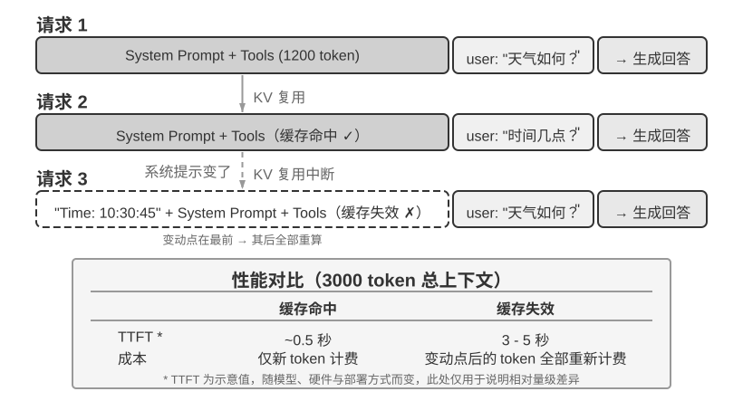
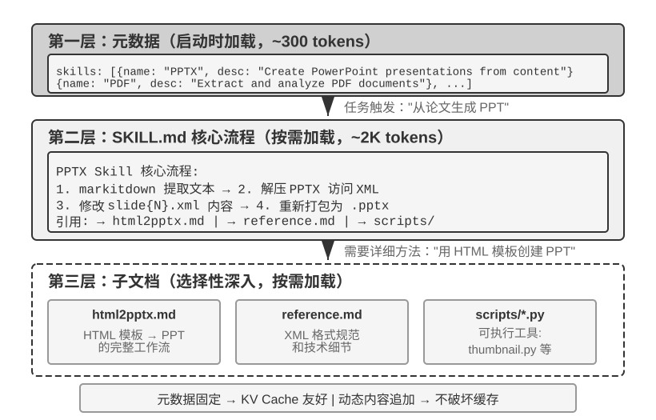

# 《深入理解 AI Agent》重点知识总结

## 第1章 AI Agent 入门

### 1. 知识总结

#### 1.1 现代 Agent 的最小工程组成是什么？它与环境是什么关系？

现代 Agent 的最小工程实现是 **Agent = LLM + 上下文 + 工具**，即“大脑 + 眼睛 + 手脚”：

1. **LLM（大脑）**：作为决策内核，负责理解意图、思考规划和选择行动；其能力来自预训练积累的知识与语言能力，以及后训练固化的决策策略。
2. **上下文（眼睛）**：表示 Agent 在每个决策点收到并保留的信息，包括环境观察、用户记忆、领域知识、自身状态和任务进展。
3. **工具（手脚）**：是 Agent 感知或改变外部世界的接口，包括工具定义、调用协议和适配器。

这个公式只描述 Agent 边界之内的实现，不包括 Environment。Agent 与 Environment 是闭环交互的两方：环境产生观察，Agent 根据上下文选择行动，行动改变环境状态，环境再返回新的观察。

这张图需要记住：Agent 与 Environment 相互独立；Agent 内部由负责决策的 Model 和负责运行、治理的 Harness 构成。

#### 1.2 观察空间与动作空间为什么是提升 Agent 能力的重要杠杆？

观察通道与动作接口共同构成 Agent 和环境的边界：Harness 把环境观察转换为模型可处理的上下文，再把模型选择的行动转换为工具调用。未进入上下文的信息对模型相当于不存在，未被动作接口允许的操作也无法真正执行。

因此，在底层模型固定时，提升任务表现最主要的系统工程手段往往是重新定义或扩展观察空间与动作空间，也就是扩展上下文和工具。许多看似需要更强模型的问题，实际是缺少必要信息或操作接口；但接口扩展应按需进行，并配合权限控制和验证。

#### 1.3 工具可以分为哪五类？

按 Agent 与外界互动的方向，工具可分为五类：

1. **感知工具**：让 Agent 访问信息，如搜索引擎、文件读取、API 和数据库查询。
2. **执行工具**：让 Agent 改变外部世界，如执行代码、操作文件、运行系统命令和调用外部 API。
3. **协作工具**：让 Agent 委托子 Agent、请求人类确认或协调其他 Agent。
4. **事件触发工具**：由邮件、定时事件或 Webhook 等外部输入激活 Agent；它不是 Agent 主动调用的工具，而是环境向 Agent 提供观察的通道。
5. **用户沟通工具**：让 Agent 通过消息、语音或邮件主动向用户传递进展、结果或关怀。

#### 1.4 工具调用如何运行？工具应如何设计？

工具调用把 LLM 从文本生成器变成能执行实际操作的系统，基本流程有四步：

1. **声明工具**：在上下文中提供工具名称、用途和参数。
2. **模型决策**：模型判断是否调用、调用哪个工具以及传入什么参数。
3. **执行并反馈**：框架执行工具，把结果追加到上下文。
4. **继续决策**：模型根据结果回复或选择下一步行动。

工具设计应从任务所需的最窄能力起步，再随复杂度扩展。通用基础能力适合组合与探索，但必须限制网络、文件范围、资源消耗等攻击面；支付、删除、发信、生产部署等高风险或强业务约束操作，应使用参数明确、权限受限、全程可审计的专用工具，必要时加入预览和人工确认。核心原则是：**通用基础能力用于组合与探索，专用工具用于约束高风险和强业务规则操作。**

#### 1.5 LLM 在 Agent 中承担什么职责？“模型即 Agent”意味着什么？

LLM 是 Agent 的决策核心，负责解析真实意图、分解任务，并持续判断下一步行动、工具和参数。它还能在不改变环境的情况下先进行内部规划与推演；这种能力建立在预训练获得的结构化知识上，而不是ß盲目随机探索。

“模型即 Agent”是指先进模型通过后训练，特别是强化学习，把工具调用的决策策略内化为原生能力。需要区分：**模型参数内化的是何时调用、调用哪个、传什么参数以及是否继续等决策；工具实现、沙盒、实际执行和结果回传仍由框架或 API 基础设施提供。** 模型自主空间越大，错误影响面也越大，外围 Harness 的约束、验证和纠正就越重要。

模型会逐渐内化 Harness 中用于弥补能力短板的适配层，但这个过程较慢，且无法一次吸收真实业务的全部约束。务实做法是：模型暂时做不稳的由 Harness 补上；模型内化一层后，Harness 卸下一层并转向新的能力边界。

#### 1.6 Agent 的行为可以通过哪三条路径更新？

按更新发生的位置和持续时间，Agent 有三条互补的能力更新路径：

1. **上下文适应**：示例、状态和检索结果进入当前任务的上下文，使模型立即调整行为；速度快、成本低，但受上下文窗口和信息组织限制，且不会自动改变后续会话。
2. **外部产物更新**：把事实和经验写入知识文档，把可语言化策略写入 Prompt 或 Skill，把确定性流程和约束写入程序或 Harness；能够跨任务保留，且可审计、可修订，但执行时仍须通过上下文或工具供 Agent 使用。
3. **模型参数更新**：通过后训练内化难以用外部规则完整表达的高维能力；部署成本较高，但能形成自然、广泛的泛化能力。

三者不是互斥选择：上下文负责临场适应，外部产物负责可控积累，参数负责内化难以显式表达的能力。

#### 1.7 Agent 的上下文由哪些部分构成？

每次调用 LLM 时，上下文由五部分构成：

1. **系统提示词**：定义 Agent 的身份、权限和行为准则，也可包含用户记忆和动态环境状态。
2. **工具定义**：声明可用工具的名称、用途和参数格式。
3. **用户消息**：包含用户输入，也可能包含 RAG 动态引入的外部知识。
4. **模型回复**：可包含思考过程、文本内容和工具调用请求。
5. **工具执行结果**：记录工具真实返回的观察，供后续决策使用。

基础模式下，系统提示词与工具定义构成相对稳定的**静态前缀**；用户消息、模型回复和工具执行结果构成持续增长的**动态轨迹**。因此，**Agent 的上下文 = 静态前缀 + 轨迹**。生产框架也可以按需把完整工具定义动态加载到上下文末尾。

#### 1.8 上下文消融实验说明了什么？

实验 1-1 通过逐一移除上下文组件，验证了各组件的作用：

1. **验证什么**：不同上下文组件对 Agent 行动、闭环控制和避免重复错误的贡献。
2. **得到什么结果**：缺少工具定义时，Agent 失去工具调用能力，却仍可能给出格式完整而数据编造的答案；缺少工具执行结果时，Agent 无法观察行动后果，可能反复重试直至耗尽预算；思考过程若能从当前观察重建，移除它的代价可能较小；历史消息则能避免重复操作和重复犯错。
3. **说明什么结论**：上下文决定 Agent 能看到什么，但组件并不等价，价值取决于其信息能否从其他观察重建；结论必须随模型迭代重新实测。尤其要警惕：**给出回答不等于完成任务**，上下文残缺时，系统可能不报错而是输出看似可信的错误答案。

#### 1.9 ReAct 循环和轨迹是什么？

ReAct（Reasoning + Acting）是把 LLM、上下文和工具串联起来的核心循环，实际包含三个环节：

1. **思考**：模型判断当前应做什么。
2. **行动**：模型发起工具调用，由 Harness 校验并执行。
3. **观察**：环境返回工具结果，结果被追加到轨迹，模型据此继续决策。

循环不断重复，直到任务完成或满足停止条件。轨迹是执行过程中不断累积的动态消息历史，包括用户消息、模型回复（思考、内容、工具调用）和工具执行结果。每轮调用都把静态前缀与完整轨迹组成新上下文，并将新响应继续追加到轨迹。

这张图需要记住：每轮“思考—行动—观察”都会把模型决策和工具结果追加到轨迹，下一轮模型基于静态前缀与完整轨迹继续推进任务。

轨迹使系统易于解释和调试，也可用于分析行为模式、优化工具与决策路径、沉淀知识或训练模型。

#### 1.10 Harness 是什么？它由哪五个要素组成？

Harness 是 **Agent 边界内、Model 之外**的运行与治理层，负责支撑模型运行并协调 Model 与 Environment 的交互。它不是“模型之外的一切”：工具定义、调用适配器、沙盒权限与重置机制属于 Harness；沙盒内的文件和进程、外部数据库、网页、用户及物理世界属于 Environment，物理部署在同一进程也不会改变这一边界。

生产形态可写为：**Agent = Model + Harness**，其中：

1. **上下文管理（Context）**：为模型提供充分、相关的感知信息。
2. **工具接口（Tools）**：提供清晰的观察与行动手段。
3. **约束（Constrain）**：限定行为边界，采用故障安全默认值，能力默认关闭、按需显式开放。
4. **验证（Verify）**：自动判断操作结果是否正确；安全检查应优先依据结构化数据，而不是可能受提示注入影响的自由文本。
5. **纠正（Correct）**：出错时重试、回退或转交人工，在确认无法恢复前避免暴露半成品状态。

上下文与工具让 Agent“能做事”，约束、验证和纠正让它“可靠地做事”。生产级 Agent 的核心竞争力越来越集中在后面三项保障机制，而非单纯提供上下文和工具。

#### 1.11 从提示工程到 Graph 工程，工程关注范围如何演进？

AI 应用工程经历了五个层层包含的关注层次：

1. **提示工程**：优化输入模型的自然语言指令。
2. **上下文工程**：系统管理模型看到的全部信息，包括系统指令、工具定义、历史和外部知识。
3. **Harness 工程**：进一步管理 Agent 边界内、模型之外的工具接口、约束、验证、反馈和错误恢复。
4. **Loop 工程**：把视野扩展到跨轮次的持续自主运行，处理任务发现、验证时机和完成判定。
5. **Graph 工程**：把 Agent 循环、确定性程序和人工审批组织为显式执行图，用节点承载能力、用边规定路由与依赖，并沿边传递和持久化结构化状态。

五者不是互相替代，而是提示工程 ⊂ 上下文工程 ⊂ Harness 工程 ⊂ Loop 工程 ⊂ Graph 工程。模型能力越趋同，竞争优势越会转移到模型之外的工程实践。

#### 1.12 构建有效 Agent 应遵循哪些核心原则？

构建有效 Agent 应遵循三个核心原则：

1. **保持简单**：从最简单的方案开始，只在确有必要时增加复杂度；每增加一层抽象，都会增加调试盲区。
2. **保持透明**：展示规划步骤、执行日志和决策轨迹，以支持调试、建立信任并允许外部纠错。
3. **设计好 ACI（Agent-Computer Interface）**：从 Agent 而非程序员的视角设计工具，使名称和参数直观，并通过“防呆”设计让易错操作从结构上无法发生。模型与工具只能通过接口沟通，模糊接口会把局部问题放大为系统性错误。

#### 1.13 Agent 应如何选择模型？

模型选型应以真实任务评估为依据，而不是只看排行榜：

1. **能力、成本与部署**：闭源模型通常能力领先，但成本较高且受 API 策略约束；开源模型成本低、可私有部署和微调，适合成本敏感或有数据合规要求的场景。
2. **工具调用与推理**：不同模型的工具调用能力差异很大；除单步简单任务或固定 GUI 操作外，多步或动态决策通常需要支持 Reasoning 的模型。
3. **策略边界**：测试模型是否愿意执行、接口是否提供所需能力、服务条款是否允许该用途，并为关键任务准备人工接管或合规模型替代路径。
4. **速度与模态**：输出 token 速度会在多轮任务中累积为端到端延迟；若任务涉及图片、音频或视频，多模态能力是硬性要求。

#### 1.14 选择 Agent 编排复杂度的基本顺序是什么？

应从简单到复杂选择编排方式：先尝试单次 LLM 调用并优化提示词和上下文；需要固定的多步骤处理时使用工作流；只有执行路径必须根据环境动态变化时，才引入自主 Agent。

Agent 会以延迟和成本换取任务性能，Harness 重要不等于 Harness 越复杂越好。程序应主要固化权限、保留原始材料等必须始终成立的边界；只有业务规则要求，或评估反复暴露出稳定失败时，才把对应步骤升级为验证器、独立 Agent 或确定性流程。

#### 1.15 工作流与自主 Agent 有什么区别？

工作流与自主 Agent 的核心区别是执行路径由谁决定：

1. **工作流**：通过预定义代码路径编排 LLM 和工具，节点顺序由开发者固定，LLM 只在节点内部理解和生成。优势是流程控制严格、安全攻击面局限于单个节点；局限是缺乏变通性，难以处理预设路径外的情况。
2. **自主 Agent**：执行路径不预先固定，由 Agent 根据环境反馈实时规划、识别失败并调整策略，本质是循环使用工具的 LLM。它适合步骤难以预测的开放任务，但成本更高、复合错误风险更大。

自主 Agent 必须设置停止条件，如任务完成、模型不再调用工具、达到最大迭代次数或遇到不可恢复错误，并配合沙盒、护栏、监控和关键节点的人机协作。

#### 1.16 工作流和自主 Agent 可以怎样混合？

两种模式可以在同一系统中混合：

1. **按风险分区**：严格合规、顺序固定的关键流程使用工作流，需要灵活判断的局部环节使用自主 Agent。
2. **先规划后执行**：先让自主 Agent 根据未知任务生成工作流或编排代码；拓扑确定后，再按工作流确定性执行。这样兼顾规划灵活性与执行稳定性，也避免模型参与每一次调度。

选择具体框架时，不应追逐框架名称，而应关注它能否以尽量少的抽象层支持业务逻辑。

#### 1.17 护栏的目标和评估原则是什么？

护栏是保障 Agent 行为安全可控的分层防线，用于管理隐私、权限、声誉等风险。单个护栏难以提供充分保护，应组合多个专门护栏，并从第一行代码开始把安全作为架构问题。

护栏也可能发生**误拒绝**，即为拦截危险请求而拒绝合法但形式敏感的任务。因此评估必须同时检查两类样本：应拒绝的请求是否被拦截，以及明确允许的请求是否仍能完成。

#### 1.18 三层护栏分别保护什么？

护栏按防护位置分为三层，其顺序表示被绕过的难度，而非请求处理顺序；越靠下越不依赖模型自身判断：

1. **上下文层——管模型能看到什么**：在内容进入上下文前使用相关性分类、安全分类、内容审核、确定性规则、来源标注和“指令/数据”分离。越狱是用户直接试图绕过安全限制，提示注入是攻击者借网页、文档等外部数据间接操纵模型。同一上下文中的 Agent 很难判断自己是否已被注入，因此这一层只能降低风险，不能提供保证。
2. **执行层——管模型能做什么**：在行动生效前依据可逆性、权限和财务影响进行工具风险评级；高风险操作交由上下文之外的独立审查、最小权限凭证、沙盒或人工确认。面向用户的回复也是行动，所以 PII 过滤和输出验证也属于执行层。
3. **数据层——管世界最终能被改成什么样**：用数据库行级安全、约束、校验器、受控视图、存储过程和不可伪造的访问上下文强制执行权限。即使提示注入成功、生成代码漏写权限判断，越权修改仍应被数据层拒绝。

#### 1.19 什么时候应触发人工干预？

人工干预用于在 Agent 无法安全继续时平稳移交控制，也有助于在部署早期识别失败模式、边缘情况并建立评估周期。主要有两类触发条件：

1. **超过失败阈值**：重试次数或操作次数超过上限时，停止自动执行并升级给人类。
2. **高风险操作**：涉及敏感、不可逆或高影响操作时触发人工监督，至少应持续到系统可靠性得到充分验证。

#### 1.20 贯穿全书的五个设计模式是什么？

五个通用设计模式是：

1. **提议者—审核者（Proposer-Reviewer）**：产出与评判由不共享上下文的角色承担，审核者只看产物、渲染结果、测试输出或结构化调用参数，而不看产出方的推理过程；依据是同一上下文中的自审不可靠。
2. **渐进式披露（Progressive Disclosure）**：先提供可检索目录，再按需加载细节，同时优化上下文预算和选择精度。
3. **只增不改（Append-only）**：状态通过追加演进，不回头修改既有内容，以获得可缓存、可重放和可审计性。
4. **边界集 + 保留集（Boundary Set + Retention Set）**：每次修改既测试应当改变的样本，也测试不应受影响的样本，避免把过拟合当进步或把无效修改当安全。
5. **最小 diff + 可回滚**：每次修改尽量小、带来源、可单独撤销，以便出现问题时准确归因。

### 2. 问题

1. 现代 Agent 的最小工程组成是什么？它与环境是什么关系？
2. 观察空间与动作空间为什么是提升 Agent 能力的重要杠杆？
3. 工具可以分为哪五类？
4. 工具调用如何运行？工具应如何设计？
5. LLM 在 Agent 中承担什么职责？“模型即 Agent”意味着什么？
6. Agent 的行为可以通过哪三条路径更新？
7. Agent 的上下文由哪些部分构成？
8. 上下文消融实验说明了什么？
9. ReAct 循环和轨迹是什么？
10. Harness 是什么？它由哪五个要素组成？
11. 从提示工程到 Graph 工程，工程关注范围如何演进？
12. 构建有效 Agent 应遵循哪些核心原则？
13. Agent 应如何选择模型？
14. 选择 Agent 编排复杂度的基本顺序是什么？
15. 工作流与自主 Agent 有什么区别？
16. 工作流和自主 Agent 可以怎样混合？
17. 护栏的目标和评估原则是什么？
18. 三层护栏分别保护什么？
19. 什么时候应触发人工干预？
20. 贯穿全书的五个设计模式是什么？

### 3. 对应章节的问题及答案

#### 习题1

如果只能给一个 Agent 系统增加一项能力——更强的模型、更丰富的上下文或更多的工具——应该如何选择？在什么条件下选择会改变？

**答案：**

应先分析失败轨迹，判断瓶颈位于感知、决策还是行动：任务所需信息没有进入上下文时补充上下文；模型即使信息充分仍无法推理时更换更强模型；系统缺少完成任务的外部操作能力时增加工具。选择会随着最短板所在位置改变，接口扩展还必须同时考虑权限和风险。

#### 习题2

ReAct 循环中，累计缓存读取量随轮数近似二次方增长，应该如何降低这种增长？

**答案：**

轨迹每轮追加而模型每次读取此前全部上下文，因此第 (i) 轮读取量随轨迹增长，累计读取费用近似 (1+2+\cdots+n=O(n^2))。可以在达到 token 阈值时批量压缩早期轨迹，只保留关键结论和任务状态；把大块中间结果外置后按需检索；或用子 Agent 隔离局部上下文。压缩不宜每轮执行，否则会损害信息、增加压缩调用，并频繁破坏缓存前缀。

#### 习题3

“模型即 Agent”与 Harness 工程越来越重要这两个趋势如何共存？Agent 框架未来的核心价值是什么？

**答案：**

模型通过后训练内化的是工具选择、参数生成和是否继续等决策策略，工具实现、执行、权限、结果回传及环境状态仍在模型之外。模型越自主，错误的影响面越大，越需要 Harness 提供上下文管理、工具接口、约束、验证和纠正。随着模型变强，框架会减少用于“翻译”和补能力短板的适配层，但权限、沙盒、验证、错误恢复和真实业务约束仍是核心价值；Harness 会不断转向模型新的能力边界。

#### 习题4

除工具结果缺失外，还有什么会让 Agent 陷入重复循环？应该如何检测和终止？

**答案：**

诱因包括工具持续返回相同错误、调用不存在的工具、关键状态在上下文压缩中丢失，以及任务本身无解。可设置最大迭代数、最大操作数和失败阈值，识别重复的“工具 + 参数 + 结果”模式，用熔断器停止无效重试；能恢复时回退或换策略，连续失败或遇到不可恢复错误时移交人工。

#### 习题5

如何用感知、行动、策略三个维度分析一个日常使用的 AI 产品？

**答案：**

先列出产品的**感知**，即它能从环境读取哪些信息；再列出**行动**，即它能调用哪些工具、能否真正改变外部状态；最后描述**策略**，即它如何理解目标、规划步骤、根据反馈调整。架构是否合理，应看失败瓶颈究竟来自观察不足、动作缺失还是决策能力不足，并检查扩展接口后是否有相应的权限、验证和停止条件。

#### 习题6

航班订票客服应选择工作流还是自主 Agent？能否混合使用？

**答案：**

主体宜采用工作流，把身份核实、航班搜索、付款和确认预订等合规顺序固定下来；需求理解、改签、航班取消后的替代方案等开放环节可使用自主 Agent。付款、退款等高风险操作还应设置明确权限和人工确认。因此最合适的是“关键流程确定性、局部判断自主化”的混合模式。

#### 习题7

当工具只在特定参数组合下变为高风险时，如何设计动态风险评估？

**答案：**

风险评级对象应从“工具”细化为“工具 + 参数 + 当前权限和影响范围”。调用前根据可逆性、目标路径、权限等级和财务影响做确定性检查，例如路径白名单、受保护目录和金额阈值；一旦参数使操作升级为高风险，就转入独立审查、预览或人工确认。安全判断应基于结构化调用参数，而不是模型生成的自由文本。

#### 习题8

受限动作空间在什么场景下优于开放式动作空间？

**答案：**

在高合规、高风险、错误不可逆或业务规则固定的场景中，受限动作空间更好，例如付款、退款、删除数据和生产部署。预定义选项可以把非法状态排除在接口之外，通过防呆设计让错误无法发生；开放式能力更适合组合和探索，但必须承担更大的验证与攻击面成本。

#### 习题9

需要人工干预但用户不在线、响应慢或指令模糊时，Agent 应该怎么办？

**答案：**

应采用故障安全默认值：未获得明确确认时暂停高风险或不可逆操作，而不是默认执行。Agent 可以先完成可逆、低风险部分，保存当前状态和待决事项，通过异步消息通知用户并设置超时；指令模糊时请求澄清。这样人类接管后能够理解上下文，Agent 也能从稳定状态恢复。

#### 习题10

哪些 Agent 工程手段可能随模型进步而过时，而其背后的设计原则仍然有效？

**答案：**

例如为能力较弱的文生图模型设置“提示词改写”节点，它把自然语言翻译成模型需要的标签格式；当多模态模型能直接理解自然语言并原生生成图像时，这个适配层会被模型内化。会过时的是针对模型能力短板的具体脚手架，不会过时的是保持简单、依据真实评估增加结构，以及对高风险边界持续实施确定性约束、验证和回滚。
## 第2章 上下文工程

### 1. 知识总结

#### 2.1 什么是上下文工程？为什么上下文会决定 Agent 的能力上限？

上下文工程是对模型每次决策时实际看到的全部信息进行系统性设计、组织和供给。上下文不仅包括对话历史，还包括系统指令、工具定义、外部知识、环境观察和任务状态；它是 Harness 中“上下文与工具”层面的核心实现。

模型要完成具体业务任务，必须获得训练时不知道的代码信息、流程规范和环境信息。模型本身的智力只是基础，信息是否充分、准确、结构清晰往往更能决定实际表现；中等模型配上优质上下文，可能胜过顶级模型在信息不足时的盲目摸索。

上下文工程也是组织问题。团队若依赖口头传递、私聊和少数人的隐性知识，就无法稳定地向 Agent 提供信息。建设 AI 原生团队因此首先要推动知识公开、可检索、结构化和文档化。

#### 2.2 模型 API 的四种消息角色与 tools 字段分别是什么？

模型 API 的上下文骨架是消息列表与独立的工具定义字段：

1. **system**：开发者编写的系统提示词，定义身份、规则和约束，通常位于消息列表开头。
2. **user**：终端用户输入的请求。
3. **assistant**：模型先前的文本回复或工具调用请求。
4. **tool**：框架执行工具后返回的结果，通过 `tool_call_id` 与对应调用关联。
5. **tools 字段**：作为请求顶层字段提供工具名称、说明和参数格式，不属于消息角色。

“四种消息角色 + tools 字段”正好覆盖系统提示词、用户消息、模型回复、工具结果和工具定义这五类上下文组成。模型 API 本身无状态，因此每次调用都必须由 Agent 框架重新提供本轮决策所需的完整信息。

#### 2.3 ReAct 循环在 API 层面如何运行？

ReAct 在 API 层面的循环是：

1. 框架发送系统提示词、用户消息和工具定义。
2. 模型决定是否调用工具，并返回工具名、参数和调用 ID；模型只提出请求，不实际执行。
3. 框架校验并执行工具，把原 assistant 消息与对应的 tool 结果追加到消息历史。
4. 框架把完整历史再次发送给模型；模型若仍需信息就继续调用工具，否则返回最终文本并结束。

无依赖的工具可以在同一轮并行执行；后一个工具参数依赖前一个结果时，必须跨轮串行调用。最小 Agent 循环的退出判断是“有 `tool_calls` 就执行并继续，没有就输出并退出”，生产系统还必须设置最大迭代次数。Agent 框架的核心工作就是正确管理持续增长的消息列表。

#### 2.4 从 API 视角看，上下文应如何布局？

上下文应布局为“静态前缀 + 动态轨迹”：

1. **静态前缀**：系统提示词与稳定的核心工具定义，尽量在整个对话中保持不变。
2. **动态轨迹**：随交互追加的用户消息、模型回复和工具执行结果。
3. **动态状态**：当前任务状态等易变信息放在轨迹末尾，而不是回头改写静态前缀。
4. **历史压缩**：接近预算时压缩旧证据，但应保留决策、约束、失败路径和来源。

这张图需要记住：前部的系统提示词和工具定义构成稳定前缀，后部轨迹只增不改并可在必要时压缩。

#### 2.5 Chat Template 是什么？为什么必须使用标准 API 消息格式？

Chat Template 是把 API 的结构化消息转换为模型实际处理的线性 token 流的模板。它用特殊 token 标记不同消息的角色和边界，不同模型家族使用不同模板，通常由 API 服务端自动处理，开发者不应自行编写或修改。

标准 API 格式的重要性在于：

1. **符合训练格式**：模型能正确区分系统指令、用户请求、模型回复和工具结果。
2. **维持多步推理**：若把工具结果错误地伪装成 user 消息，部分模型会误以为用户开启了新话题并清理历史思考，破坏长程计划。
3. **支持缓存**：Chat Template 把稳定消息转换为固定 token 前缀，便于缓存复用。

不同模型对历史思考的协议不同：有的剥离历史思考，有的在带工具时要求原样回传，有的要求回传带签名的 thinking block。应遵循对应模型的最新文档，尤其不能假设不同厂商的轨迹可以无缝交接。

#### 2.6 注意力机制和上下文学习对信息布局有什么启示？

注意力机制中，当前 token 的 Query 与前文 token 的 Key 计算相关性，再按权重汇总相应 Value。因果模型只能关注当前及之前的 token，因此注意力图呈三角形。

对上下文设计有三点启示：

1. **位置偏好**：模型通常更关注上下文开头和结尾，中部信息更容易被忽视，关键规则应置于稳定前部，当前状态应置于末尾。
2. **上下文学习更像检索**：模型擅长从已有内容中找相关记录，却不擅长在一次前向传播中自动统计、建索引和提炼结论；多步推理可以弥补，但每次都要重新付出思考成本。
3. **应补充提炼层**：把隐式状态预先汇总成状态栏，把冗长记录压缩成结构化知识，让需要推理才能得到的结论变成可直接检索的信息。

#### 2.7 KV Cache 与 Prompt Cache 分别是什么？

两者都利用前缀不变性，但作用层级不同：

1. **KV Cache**：模型内部在一次推理中缓存历史 token 的 Key、Value，避免生成每个新 token 时重算整个前缀。它省去历史 K、V 投影的重复计算，但新 token 的注意力仍要遍历已有缓存，因此长上下文仍会增加解码开销、显存和带宽压力。
2. **Prompt Cache**：推理服务在多次 API 请求间匹配相同前缀，复用先前计算出的 KV Cache，减少重复 prefill 的延迟和成本。

如果第 k 个 token 发生变化，只能复用其之前的缓存，从第 k 个 token 起都要重算；变动越靠前，通常影响越大。

这张图需要记住：稳定前缀可跨请求复用；在前部注入动态内容会让变动点之后的大段缓存失效。

#### 2.8 怎样设计对 KV Cache 友好的上下文？

对 KV Cache 友好的设计有三条基础原则：

1. **稳定前缀不改动**：系统提示词和核心工具定义一旦确定就保持内容与顺序稳定，空格等 token 级变化也可能导致后续缓存失效。
2. **动态信息追加到末尾**：时间、用户状态和运行时摘要作为新消息追加，不注入系统提示词前部。
3. **使用标准 API 格式**：不要自行拼接角色文本；自行拼接的主要问题是偏离训练格式，若拼接字节不稳定还会额外破坏缓存。

应避免动态系统提示词、在前缀中反复更新用户配置、动态排序工具、机械滑动窗口和把结构化消息扁平化为纯文本。滑动窗口不仅改变前缀，还可能丢掉关键工具结果，使 Agent 忘记已完成的操作并陷入循环。

#### 2.9 为什么缓存经济性是一项架构约束？

当 Prompt Cache 的收益足够大时，缓存一致性会反过来决定系统结构，而不只是上线后的性能优化：

1. **缓存边界决定提示词顺序**：可跨用户复用的内容放在边界前，用户、会话和运行时条件放在边界后，以避免缓存键组合爆炸。
2. **继承上下文的子 Agent 与父 Agent 对齐**：若希望复用父 Agent 的缓存，提示词、工具、模型配置、消息前缀和思考配置必须字节级一致；使用独立上下文的子 Agent 不受此约束。
3. **替换字符串冻结**：大工具输出一旦被摘要预览替换，恢复会话时也应复用完全相同的字符串，避免字节流变化。

因此，缓存经济性应在架构设计阶段纳入考虑。

#### 2.10 系统提示词应如何设计？

系统提示词是 Agent 的“员工手册”，实用标准是：聪明的新员工读完后是否知道该怎么做。设计要点包括：

1. **语气与风格**：明确长度、口吻和失败时的表达；大写强调只用于真正关键的约束，过度使用会稀释效果。
2. **结构化表达**：用 Markdown 组织人可读层次，用 XML 等标签标明机器可解析的语义块。
3. **流程驱动**：优先给出有阶段、有顺序、有异常分支的 SOP，而不是堆砌大量无序规则，使模型知道当前阶段和下一步。
4. **细化业务规则**：把分类边界、例外、计算方法和禁止项写到可执行程度，减少模型自由裁量。业务逻辑应由产品经理依据数据、反馈和运营经验制定，工程师负责准确编码。

设计目标不是替模型思考一切，而是用清晰框架释放其认知资源，让它专注于真正需要判断的部分。

#### 2.11 Few-shot 示例和工具定义应如何设计？

Few-shot 示例适合难以用规则精确描述的输出风格、格式和语气；若规则容易说明或模型本就擅长，示例只会浪费 token。通常两三个覆盖边界情况的高质量示例，优于十个相似示例。示例位于上下文前部，应按任务类型使用稳定示例集，避免逐请求动态检索导致缓存持续失效。

工具定义应让首次使用者就能正确操作，至少说明用途、参数、边界、示例、性能建议和工具间协作关系。大量工具可采用渐进式披露：静态前缀只保留名称和简述，模型搜索到工具后，把完整 schema 追加到轨迹末尾；已加载的 schema 固定在首次出现位置，不在每轮搬动。该方式要求模型接受过“工具定义出现在对话中间”的相应训练。

#### 2.12 提示工程消融实验说明了什么？

实验 2-4 的结论是：

1. **验证什么**：语气风格、信息组织和工具描述分别如何影响复杂客服任务。
2. **得到什么结果**：改变语气明显影响表达，但对任务完成率影响有限；保留规则内容却打乱流程和层次，会使成功率显著下降并导致关键业务规则被违反；保留函数签名却移除描述，会明显增加参数错误和语义误解。
3. **说明什么结论**：信息如何组织和接口如何描述，比表面语气更直接地影响 Agent 的可靠性；对人类友好的结构通常也对模型友好。

#### 2.13 什么是提示注入？上下文层如何防御？

提示注入是攻击者把伪装成指令的文本藏入网页、邮件、文档、图片元数据等外部内容，使其进入上下文并劫持 Agent 行为。它比普通聊天中的不当输出更危险，因为被劫持的 Agent 可能借助工具删除文件、发送信息或泄露数据；每个感知工具都是潜在入口。

上下文层的核心是帮助模型区分“有权指挥的指令”和“只供处理的数据”：

1. **来源标记**：用明确标签包裹外部内容并注明不可信来源。
2. **结构化角色**：严格使用 system、user、assistant、tool 的标准角色保留来源和优先级。
3. **输入清洗**：过滤常见可疑模式，但它容易被措辞变体绕过，只能辅助防御。
4. **审查高信任内容**：安装第三方 Skill 前像审查代码一样检查内容，状态栏也不能直接写入可能受污染的外部文本。

这些措施只能降低攻击成功率，不能给出安全保证；还必须结合执行层权限、沙盒和独立高风险审查。

#### 2.14 Agent Skills 是什么？渐进式披露有哪三个层次？

Agent Skills 是可独立开发、测试、版本控制并按需加载的领域知识包，本质是专项任务的操作手册，也可携带脚本和模板。它用渐进式披露解决“全部指令塞进系统提示词”导致的 token 浪费和注意力稀释：

1. **第一层——元数据目录**：在完整正文之前可见，至少包含 `name` 和 `description`，用于发现和路由。description 应写成“何时使用、何时不使用”的路由条件，并包含必要反例，而不是宽泛功能介绍。
2. **第二层——核心流程**：选中 Skill 后才加载完整 `SKILL.md`，说明主要步骤、边界与完成标准。
3. **第三层——细则和资源**：根据当前任务选择性读取子文档、模板和可执行脚本。

核心原则是“少量目录常驻、完整正文按需加载”。

这张图需要记住：Agent 先用低成本元数据选择能力，再按需加载核心流程和更深的细则、脚本与模板。

#### 2.15 一份可用的 Skill 应包含什么？

一份可用的 Skill 应让新加入团队的人明确何时使用、按什么顺序行动、何时暂停确认以及什么结果算完成。建议包含：

1. **角色与读者**：说明服务对象、任务范围和输出标准。
2. **核心原则**：保留三到五条最重要判断，并为关键原则给出正反例。
3. **禁止清单**：记录高频错误、越权动作和易误解表达，同时写清合法例外。
4. **参考资料**：收纳术语、模板、范文和详细子文档。

规则宜写成“作用域 + 动作 + 例外 + 验证方式”。Skill 应通过真实任务和人工修改持续迭代；原稿与改稿之间的差异，比抽象要求更能揭示稳定规则。选择 Skill 的触发和注入方式时还应与模型厂商训练过的交互模式一致。

#### 2.16 Skills 如何进入上下文？它与工具有什么关系？

Skills 规范规定的是加载时序，不强制具体消息角色。不同 Harness 可把目录放在不同上下文层，并把正文作为 user 片段、tool result 或文件读取结果追加到调用位置；用户显式触发可由客户端直接展开，模型自主选择通常多一次 ReAct 往返。无论实现如何，共同点都是先发现目录、再按需加载正文。

Skills 对缓存友好但不是零成本：目录和正文首次进入时仍需计算，之后在前缀稳定时才能复用。与大量专用工具相比，“少量通用执行器 + Skills”能减少常驻工具 schema，把操作方法和领域知识按需注入；但专用工具在高风险、强约束场景中仍有独立价值。

#### 2.17 什么是 Agent 状态栏？它为什么有效？

Agent 状态栏是 Harness 在上下文末尾注入的结构化运行时状态摘要，例如任务进度、工具调用计数、当前时间和环境信息。它不是对话主体，而是帮助模型随时看到“当前处于什么状态”的元信息。

其原理是把散落在长轨迹中的隐式状态，预先提炼成可直接检索的显式知识。模型无需每轮扫描原始记录重新计数或归纳；状态放在末尾也能利用位置偏好，把注意力引向当前目标和约束，从而减少循环、状态遗忘和目标偏离。

这张图需要记住：状态栏不是增加新的原始事实，而是把轨迹中分散的关键状态提炼后放到末尾，使模型能直接使用。

#### 2.18 Agent 状态栏应包含什么，并放在上下文哪里？

状态栏主要包含三类信息：

1. **任务规划**：目标、约束、TODO 及各项状态，防止只顾局部任务。
2. **事件侧信道信息**：时间、位置、距上次回复的间隔等辅助元数据。
3. **环境观察摘要**：当前目录、系统环境、工具计数和异常操作提醒等。

在 API 层面，状态栏通常借用一条由 Harness 自动生成的 user 角色消息放在轨迹末尾；这里的 user 是协议槽位，并非真实用户输入。这样既靠近下一个生成 token，又不改动开头的系统消息。

状态更新有两种方式：**每轮替换**只保留最新状态，会让旧状态位置之后的短后缀缓存失效，但避免陈旧状态累积；**持久追加**从不删除旧状态，对缓存最友好，但会占用 token，并要求模型识别最新状态。状态小、更新间隔产生的消息多且会话受控时倾向追加；状态大、更新频繁或轨迹很长时倾向替换。

#### 2.19 如何保证状态栏可靠？

状态栏应尽量由确定性代码维护；确需 LLM 时，应逐条抽取后由代码汇总，不能让模型一次性对长历史做批量统计。原因是模型通常高度信任状态栏，错误计数或受污染摘要会直接传导为错误行动。

状态栏是原始上下文的有损投影，只包含设计者预先选择的维度。计数、状态跟踪等问题在状态栏足够时可以删除原始记录；若后续问题可能涉及未提炼的维度，就必须谨慎保留原始证据或可回溯索引。

实验表明，提前提供结构化状态能显著降低小模型的统计错误和思考成本，使思考量不再随轨迹持续增长；但这项收益依赖状态本身准确、可验证且不受外部投毒。

#### 2.20 为什么要压缩上下文？上下文腐化与溢出有什么区别？

上下文压缩有三个目的：

1. **控制长度、成本和延迟**：避免工具结果撑满窗口并降低持续推理开销。
2. **提升思考质量**：把分散原始记录转为高密度结构化知识，使模型直接使用结论而不是反复检索和统计。
3. **缓解上下文焦虑**：防止模型因认为窗口即将耗尽而在任务完成前过早收尾。

上下文溢出是“信息装不下”，上下文腐化是“仍装得下但关键内容已难以找到”。后者更隐蔽：模型看似仍在运行，实际因无关内容占比上升、注意力被稀释而逐渐降低决策质量。因此，即使窗口未满也可能需要压缩。

#### 2.21 上下文压缩如何与 KV Cache 共存？

压缩发生在两次模型调用之间，由 Harness 预处理消息列表，而不是在一次推理过程中修改缓存：

1. **静态前缀不动**：系统提示词和核心工具定义继续复用缓存。
2. **主要压缩历史工具结果**：摘要替换点之后的缓存会失效，但之前的部分仍可复用。
3. **批量而非频繁压缩**：接近阈值时集中压缩，避免每轮破坏缓存。
4. **保留可回溯性**：把原始大输出存到外部，只在上下文保留摘要、标识和来源链接。

压缩是有意识的权衡：牺牲一次局部缓存重建，换取窗口可用、信息密度和后续决策质量。

#### 2.22 上下文压缩策略对比实验说明了什么？

实验 2-10 的结论是：

1. **验证什么**：无压缩、非任务感知摘要、上下文感知摘要、带引用摘要与自适应窗口化对长程研究任务的影响。
2. **得到什么结果**：无压缩很快耗尽窗口；逐结果摘要会产生碎片与重复，统一摘要又可能因超长截断丢失末尾信息；把当前查询和已知信息纳入压缩决策的上下文感知策略，使用更少迭代和 token 完成任务；带引用策略提供回溯路径；自适应策略在接近阈值后才批量压缩，可尽量保留早期探索的完整性。
3. **说明什么结论**：压缩必须理解任务相关性，而不是只缩短文本；理想策略应兼顾语义保留、来源回溯、压缩时机和缓存代价。

这张图需要记住：上下文感知压缩把查询意图和已有信息纳入决策，在实验中同时取得了较低 token 用量和较少迭代次数。

#### 2.23 生产级压缩应采用哪些层次和原则？

生产系统通常采用分层压缩：

1. **工具结果预算控制**：大输出外置，只给模型摘要预览，并冻结替换字符串。
2. **噪声直接删除**：低价值内容不值得再花 token 做摘要。
3. **API 层微压缩**：临近溢出时移除指定工具结果，接受一次缓存重建。
4. **归档式摘要**：逐轮保留结构化记录和逻辑脉络，而不是全部揉成一条。
5. **全量压缩**：作为最后手段，并用熔断器防止连续压缩失败造成无限消耗。

设计应遵守四项原则：**信息价值非均匀**，优先保留决策和标识；**语义完整**，不丢影响结论的时间、主体和条件；**任务相关**，按检索、分析或创作任务保留不同信息；**压缩即理解**，压缩模型需要足够强，并让结果可检查、可复用。还应定期把架构决策、约束理由、失败路径和进展记录到文档中，而不是只留在执行历史里。

#### 2.24 为什么说“隔离优于压缩”？

压缩是在信息进入主上下文后做有损减法；子 Agent 上下文隔离则让大体积中间信息从一开始就不进入主上下文。主 Agent 把广泛搜索等任务委派给独立子 Agent，子 Agent 在自己的上下文中探索，只返回自包含的结论摘要。

隔离可减少主上下文噪声、避免额外压缩调用，并保持主 Agent 的 KV Cache 前缀稳定。代价是子 Agent 看不到主 Agent 的完整上下文，所以委派任务必须目标明确、信息自包含。两者不是绝对替代：适合独立探索的内容优先隔离，已进入主轨迹且仍有保留价值的内容再按需压缩。

### 2. 问题

1. 什么是上下文工程？为什么上下文会决定 Agent 的能力上限？
2. 模型 API 的四种消息角色与 tools 字段分别是什么？
3. ReAct 循环在 API 层面如何运行？
4. 从 API 视角看，上下文应如何布局？
5. Chat Template 是什么？为什么必须使用标准 API 消息格式？
6. 注意力机制和上下文学习对信息布局有什么启示？
7. KV Cache 与 Prompt Cache 分别是什么？
8. 怎样设计对 KV Cache 友好的上下文？
9. 为什么缓存经济性是一项架构约束？
10. 系统提示词应如何设计？
11. Few-shot 示例和工具定义应如何设计？
12. 提示工程消融实验说明了什么？
13. 什么是提示注入？上下文层如何防御？
14. Agent Skills 是什么？渐进式披露有哪三个层次？
15. 一份可用的 Skill 应包含什么？
16. Skills 如何进入上下文？它与工具有什么关系？
17. 什么是 Agent 状态栏？它为什么有效？
18. Agent 状态栏应包含什么，并放在上下文哪里？
19. 如何保证状态栏可靠？
20. 为什么要压缩上下文？上下文腐化与溢出有什么区别？
21. 上下文压缩如何与 KV Cache 共存？
22. 上下文压缩策略对比实验说明了什么？
23. 生产级压缩应采用哪些层次和原则？
24. 为什么说“隔离优于压缩”？

### 3. 对应章节的问题及答案

#### 习题1

如何既避免滑动窗口造成的信息丢失，又控制上下文长度并尽量保护 KV Cache 前缀？

**答案：**

不能像滑动窗口那样机械丢弃最早消息。应让系统提示词和核心工具定义保持稳定，轨迹平时只追加；大工具输出落盘并保留摘要与索引，低价值噪声删除，接近 token 阈值时对旧工具结果做一次批量、任务感知的压缩，并保留决策、约束、失败路径和来源。能独立探索的任务交给子 Agent，只把结论带回主上下文。

#### 习题2

超长 ReAct 循环应如何处理历史思考？剥离全部历史思考与强制回传全部思考各有什么利弊？

**答案：**

可按 token 预算保留最近思考，把较早部分批量压缩为结构化状态，包括当前目标、已确认事实、排除路径、失败原因和 TODO，并避免每轮压缩。全部剥离能节省 token，且在相应训练协议下避免分布外输入，但模型每轮可能重新推理、遗忘计划并重复犯错；全部回传能保持长程连贯，却会持续扩大上下文与成本。两种策略的优劣取决于模型训练协议和 Agent 是否把思考当作任务状态，因此必须遵循具体模型的最新接口要求。

#### 习题3

极端的上下文感知压缩是否存在不可逆信息损失？如何缓解？

**答案：**

存在风险，因为压缩是有损投影，未被摘要保留的维度可能永久缺失。应采用“有损摘要 + 无损索引”：原始输出外置保存，摘要中的事实附带 URL、文件路径、哈希或其他标识以便回溯；保留影响结论的主体、时间、条件、决策理由和验证状态；上下文充足时延迟压缩，接近阈值再批量处理。

#### 习题4

如何缓解状态栏错误导致的“元信息可靠性”问题？

**答案：**

状态栏应优先由确定性代码从可靠事件中维护；需要 LLM 时只让它逐条抽取，再由代码聚合，避免一次性统计长历史。还应验证状态生成逻辑、监控状态准确率、保留必要原始证据，并禁止把未经处理的网页或文档片段写入高信任状态栏，以防投毒。

#### 习题5

多人长期维护系统提示词时，如何防止结构不断混乱？

**答案：**

应把提示词当作代码管理：使用版本控制、评审和基于真实任务的回归测试；由产品经理定义业务规则，工程师负责结构化编码；用 Markdown/XML 划分模块，以 SOP 组织流程、优先级、异常和例外。动态信息移到缓存边界之后，膨胀的专项内容拆成按需加载的 Skills，避免在一个文件中持续堆叠零散规则。

#### 习题6

如果上下文学习更像检索而非推理，应如何突破“只塞更多信息”的局限？

**答案：**

应为上下文补上“提炼层”：用代码维护状态栏，把隐式计数和进度转成显式知识；用任务感知压缩将原始记录蒸馏为高密度摘要；把大规模探索委派给隔离的子 Agent，防止噪声进入主上下文；对仍需验证的事实保留可回溯索引。目标不是让模型反复从更多原文中现算结论，而是让它直接检索经过提炼、可验证的信息。

#### 习题7

如何缓解 Skills 路由中的“模型不知道自己不知道什么”问题？

**答案：**

首先让简短的 Skill 元数据目录在完整正文之前始终可发现，使模型知道有哪些外部能力。其次把 description 写成明确的路由条件，包含“何时使用、何时不使用”和典型反例，减少过宽或过窄的触发。对于用户明确知道要用的能力，可通过显式命令绕过模型的自主路由判断。

#### 习题8

Agent 动态读取 Skill 后能否正确遵从？不同模型为什么会有差异？

**答案：**

能否正确遵从取决于模型是否针对相应注入位置和协议训练过。Skill 正文可能作为 user 片段、tool result 或文件读取结果进入上下文，不同模型对中途出现的指令、历史思考保留和工具协议的支持不同。应采用模型厂商推荐的交互方式并通过真实任务测试，不能把一个生态的注入方式直接假定为另一模型的最佳方式。

#### 习题9

工具很多且频繁变化时，怎样布局上下文以提高缓存命中率？

**答案：**

把少量稳定核心工具以固定内容和顺序放在静态前缀；只常驻其余工具的名称、服务器说明或简短目录，完整 schema 由工具搜索按需发现后追加到轨迹末尾，并固定在首次出现的位置。也可用少量通用执行器配合 Skills 承载操作方法。动态状态放在缓存边界之后；需要继承父上下文的子 Agent 则与父 Agent 保持字节级前缀一致。
## 第3章 用户记忆和知识库

### 1. 知识总结

#### 3.1 用户记忆与知识库有什么关系？

用户记忆与知识库是跨会话持久化知识的两个尺度：

1. **用户记忆**：面向单个用户，保存其偏好、习惯、关系和需求，使 Agent 成为“懂你的助手”。
2. **知识库**：面向一组用户共享，保存行业法规、企业流程和专业文档，使 Agent 成为“领域专家”。

两者都把知识从模型参数外部注入未来任务，共用向量检索和知识压缩等技术，也共同面对冲突、过期、检索不准和隐私风险。用户记忆不应保存每句对话，而应在会话后用额外处理提取对未来有用的信息，并满足**选择性、抽象化和结构化**。其基本生命周期是：读取相关记忆 → 后台提取候选 → 核验来源与策略 → 更新。

这张图需要记住：用户记忆与知识库尺度不同、检索底层相通，最终汇合为“结构化概览常驻 + 原始细节按需检索”的双层架构。

#### 3.2 用户记忆能力应如何分层评估？

面向 Agent 的用户记忆能力可分为三个递进层次：

1. **基础回忆**：准确存取用户直接提供的、结构化且无歧义的信息，是记忆可靠性的底线。
2. **多会话检索**：从不同时间、对象和渠道的多段会话中找全相关信息，并进行联合判断、区分有效状态和关联复合事件。
3. **主动服务**：在用户没有明确要求时，综合相隔很久、表面无关的记忆发现风险或机会，主动提供完整帮助。

评估不能只测“是否记住一条事实”，还要覆盖偏好追踪、上下文切换、更新、多会话连续性、复杂推理、时间感知和冲突解决。

#### 3.3 记忆设计中的“放哪里、怎么存、存什么”分别指什么？

记忆设计包含三套彼此正交的分类：

1. **放哪里——记忆层次**：轨迹保存当前会话按时间追加的原始事件；用户长期记忆保存跨会话提炼的稳定信息；业务状态表示任务所处逻辑阶段。
2. **怎么存——存储格式**：可选择 Simple Notes、Enhanced Notes、JSON Cards、Advanced JSON Cards 或进一步的可执行状态。
3. **存什么——认知类型**：情景记忆保存具体事件，语义记忆保存抽象事实，程序记忆保存行为模式与流程。

轨迹是只增不改的流水账，长期记忆是会被合并、修订和淘汰的档案。工作记忆则是当前决策所需、按相关性筛选和激活的动态子集，不等同于不可变的完整轨迹。

#### 3.4 用户记忆的四种文本存储格式如何取舍？

四种格式在简单性与表达力之间逐级变化：

1. **Simple Notes**：每条记忆是不可再分的事实，开销最低，但会割裂关联，难以回答需要组合信息的问题。
2. **Enhanced Notes**：用完整段落保留叙事和语义，信息丰富，但容易冗余，属性变化时更新复杂。
3. **JSON Cards**：用类别、子类别和键值对组织信息，支持局部更新且结构可预测，但刚性分类难以表达跨维度事实。
4. **Advanced JSON Cards**：增加 backstory、person、relationship 和时间戳，能处理不同人物、关系与情境下的实体消歧，但生成和维护成本最高。

这张图需要记住：从 Simple Notes 到 Advanced JSON Cards，简单性递减、语义和消歧能力递增，维护成本也随之上升。

实践中通常混合使用：关键且少量的偏好与人物关系用 Advanced JSON Cards，大量非关键事实用 Simple Notes。实验也表明，Simple Notes 足以处理多数基础回忆，但在跨会话关联和同名实体消歧上易失败；Advanced JSON Cards 表现更好，但更慢、更贵。

#### 3.5 为什么可以把用户记忆表示为可执行代码？

文本记忆擅长召回事实，却常把聚合、冲突检测和约束执行交给 LLM“心算”。可执行记忆把用户状态表示为带类型的对象，把规则写成确定性函数，使表示与推理使用同一种可验证介质。

稳妥结构是“只增日志 + 派生检查点”：会话后先把事实追加到原始日志，再定期从完整日志重建类型化状态。这样既保留证据，也能用程序可靠地执行聚合统计、冲突发现和约束检查。它适合可结构化、需精确计算和自动校验的用户状态，但不取代难以形式化的自然语言记忆。

#### 3.6 情景记忆、语义记忆和程序记忆分别是什么？

长期记忆按内容可分为：

1. **情景记忆**：保存具体事件的时间、对象和细节，如某次订票经历。
2. **语义记忆**：从事件中抽象出一般性知识，如用户是素食者或偏好靠窗。
3. **程序记忆**：保存行为模式和流程，如用户订票时通常遵循的步骤。

工作记忆对应当前任务的临时信息空间，其中既包含轨迹，也可包含从长期记忆中激活的信息。实际系统不必追求所有类型都实现，应按业务需要选择。

#### 3.7 记忆冲突可以在写入时解决，也可以在检索时解决，两者如何取舍？

两种代表性策略是：

1. **写入时消歧**：候选事实写入前先检索相近旧记忆，再判断 ADD、UPDATE、DELETE 或 NOOP。优点是记忆库简洁一致；缺点是错误更新或删除可能不可逆地丢失历史，且每条事实需要额外判断。
2. **只追加写入、检索时推理**：新旧事实连同时间信息并存，查询时融合语义、关键词、实体和时间信号找出当前有效事实。优点是保留历史、减少写入调用；缺点是把冲突处理复杂度转移到检索阶段。

不能对所有冲突机械采用“最新覆盖”：地址可能以最新为准，经历则可能需要完整时间线；若不同说法分别适用于不同对象、时间或条件，应显式保存其适用范围。

#### 3.8 用户记忆应如何压缩与整理？

记忆持续积累会造成存储膨胀和检索精度下降，可采用三层策略：

1. **重要性筛选**：综合访问频率、时间衰减、情感强度和独特性，标记低价值记忆。
2. **聚类摘要**：把相似记忆分组并生成代表性摘要，原始细节可归档到二级存储。
3. **抽象泛化**：从多个具体情景中提炼稳定的语义记忆或程序记忆。

压缩不能让摘要取代原始证据；应保留可追溯路径，并防止多轮摘要把早期遗漏和误读持续放大。

#### 3.9 用户记忆和日志如何保护隐私？

目标是利用用户信息提供个性化服务，同时避免敏感数据暴露在 LLM 上下文和日志中。结构化号码、地址和自然语言密码等信息都需要检测与脱敏。

若日志本身敏感，用云端模型脱敏可能违背保护初衷，可优先使用本地模型并输出结构化的类型、位置和置信度。高吞吐场景可采用混合方案：正则快速处理明显模式，本地 LLM 分析复杂自然语言表达。脱敏之外，还必须按用户和租户限制记忆的读取、检索和审核范围。

#### 3.10 RAG 是什么？它的基本流程是什么？

RAG（检索增强生成）把 LLM 的推理生成能力与可持续更新的外部知识库结合。典型系统包含检索器和生成器：检索器从知识库找到相关片段，生成器把片段作为上下文回答问题。

基本流程是：**文档分块并建立索引 → 根据查询检索相关片段 → 把片段注入上下文 → LLM 基于证据生成答案**。它既服务共享知识库，也可用于从海量用户记忆中找回相关信息。

#### 3.11 文档分块为什么必要？常见策略有哪些？

分块把长文档切成可独立检索的片段。它之所以必要，是因为嵌入模型有输入长度限制，整篇文档的多个主题会稀释单一向量；同时，检索应只把相关部分注入上下文，避免无关内容浪费窗口。

常见策略有：

1. **固定大小切分**：简单可预测，并用重叠避免边界断句，但会破坏自然结构。
2. **递归或结构感知切分**：优先按章节、段落和句子等自然边界切分，是结构化文档常用的默认方案。
3. **语义切分**：在相邻句子相似度突降处切分，主题更单一，但需要额外嵌入计算。

块太小会丢失语义完整性，块太大会混合主题并带入噪声；需根据检索质量实测调整大小和重叠。任何分块都会损失原始上下文，这是后续上下文感知检索要修复的问题。

#### 3.12 稠密检索的原理、优势和局限是什么？

稠密嵌入用深度学习把文本映射为高维向量，使语义相近的内容在向量空间中靠近。常用余弦相似度比较向量方向，以衡量语义相关性。上下文感知模型能让同一个词在不同语境中得到不同表示，克服静态词向量无法处理一词多义的问题。

稠密检索擅长同义表达、跨语言和语义相似查询，但可能漏掉型号、错误码、人名等必须精确匹配的关键词。大规模向量检索通常采用 ANN 索引：ANNOY 构建快、内存低，适合不常变化的静态数据；HNSW 精度更高且支持增量更新，但构建慢、占用更多内存，长期增量后仍宜定期重建。

#### 3.13 稀疏检索及 BM25 的核心思想是什么？

稀疏检索把文档表示为词项维度极高、绝大多数值为零的向量，核心是关键词精确匹配。TF-IDF 认为词在当前文档出现越多、在全集越少见，区分力越强；BM25 在此基础上加入：

1. **词频饱和**：同一词反复出现的边际贡献逐渐降低。
2. **长度归一化**：避免长文档仅因词更多而获得过高分数。
3. **稀有词加权**：较少文档出现的词权重更高。

稀疏检索依托倒排索引，适合技术代码、专名和精确关键词，速度快且可解释；局限是难以识别同义表达和深层语义。

#### 3.14 混合检索流水线如何工作？

生产级混合检索通常包含三个阶段：

1. **并行召回**：同时运行稠密检索和稀疏检索，分别覆盖语义相似与精确匹配。
2. **结果融合**：把两路候选合成统一候选池。由于余弦相似度和 BM25 得分尺度不同，不能直接相加；RRF 可忽略原始分数，用各路排名的平滑倒数融合。
3. **神经重排序**：跨编码器把查询和候选文档拼接后深度匹配，对候选池精排。它比独立编码查询和文档的双编码器更准确但更慢，因此适合小范围精排，不能替代前面的召回与融合。

这张图需要记住：稠密和稀疏检索负责互补召回，融合负责形成候选池，跨编码器重排序负责最终精排。

实验表明，没有单一检索方式能在所有查询上稳定胜出，三者组合才是更可靠的生产方案。

#### 3.15 应用哪些指标评估检索质量？

检索系统应在带标注答案的测试查询集上评估：

1. **recall@k**：标准定义是前 k 个结果召回的相关文档占全部相关文档的比例；部分报告把“前 k 个中是否至少出现一篇相关文档”也称为 recall@k，但严格说这是命中率，跨来源比较时要核对口径。
2. **MRR**：计算第一个相关文档排名的倒数并取平均，衡量正确结果是否足够靠前。
3. **nDCG**：同时考虑所有相关文档的相关程度和排名位置，衡量整个排序列表质量。
4. **检索失败率**：正确证据未进入指定 top-k 结果的查询比例。

对 RAG 而言，先保证相关证据进入上下文，再谈生成质量。

#### 3.16 为什么不能把原始案例或文档直接平铺进知识库？

原始案例平铺会产生三个问题：

1. **聚合不完整**：top-k 只能返回部分样本，无法可靠回答总体计数和比例。
2. **边界语义缺失**：单个案例只记录个案结论，无法表达“仅限哪些情况、其余不适用”的全称与否定规则。
3. **缺少完整性信号**：模型不知道自己是否看全，容易基于局部样本自信推断。

因此必须在索引阶段投入计算，对原始材料主动提炼、抽象和结构化，例如把大量个案转为统计摘要，把分散工单归纳为带条件和例外的规则卡。无论使用向量库还是长上下文，未经提炼的原始知识都难以可靠利用。

#### 3.17 RAPTOR 与 GraphRAG 分别适合什么知识和查询？

两种结构化索引解决不同问题：

1. **RAPTOR**：将小文本块作为叶子，聚类相近内容并递归生成父级摘要，形成从细节到概览的树。适合从宏观概念逐层下钻到具体细节的多粒度查询。
2. **GraphRAG**：把知识建模为实体—关系—实体三元组和社区摘要。适合多跳关系推理、实体消歧和“谁与谁有什么关系”的查询。

GraphRAG 对条件、时间依赖等复杂自然语言可能造成语义降级，且错误抽取会污染图谱。因此推荐以完整自然语言保存核心语义，用结构化元数据辅助索引；只在多跳关系和精确消歧价值明显的垂直场景使用知识图谱。若需求只是寻找包含某信息的片段，混合检索通常足够；经常跨文档综合或多层导航时，结构化索引才值得额外成本。

#### 3.18 文件系统范式如何组织知识？

文件系统范式把资源、用户记忆、Agent 技能和经验映射为带唯一 URI 的虚拟目录与文件，并采用 L0/L1/L2 渐进式加载：

1. **L0 摘要**：极短概述，用于判断目录是否相关。
2. **L1 概览**：核心信息和使用场景，供 Agent 规划。
3. **L2 全文**：仅在需要深入时加载原始内容。

用 Markdown 纯文本作为底层表达，便于用户直接阅读和修正，也能使用 Git 版本控制、审核和回滚。但纯文本只有在文件间建立链接、入口页和索引页时才有导航价值；孤立文件越多，检索反而越困难。写入提示应要求新增条目前先检索并链接相关知识，同时维护索引，防止形成知识孤岛。

#### 3.19 知识的增量更新应如何设计？

增量更新处理新证据引发的局部修改，稳妥做法是把知识库当代码库、把变更当 PR，并使用提议者—审核者闭环：

1. **Proposer 提交最小 diff**：先检索相关旧知识，再增删改条目，并维护链接、索引、时间和证据引用；只能写工作分支。
2. **Reviewer 独立审核**：访问授权范围内的完整知识库和原始证据，检查每个断言、限定条件、冲突和删除范围；只读证据并提交审核意见。
3. **迭代与熔断**：双方按具体证据反复修订，设置最大次数或成本，未收敛时转人工，不能默认放行。
4. **合入后发布**：CI 检查格式、链接、元数据、权限标签及代码测试，随后从已合入版本重建受影响的摘要、分块和索引。

应区分原始证据层、可修订知识层和可重建服务索引层。Proposer 与 Reviewer 应优先采用能力相近但不同家族的模型，以降低共同盲点；异源互审不能替代证据核验。

#### 3.20 为什么知识库还需要定期全量整理？

增量更新只能看到局部，多次局部正确仍可能累积成重复、过期、冲突和目录失序。定期整理至少包括：

1. **去重、去旧与重组**：合并重复和碎片条目，调整文件与目录，重建链接和索引；删除的是服务知识，不是原始证据。
2. **回到原始数据核查**：不能只在摘要间互相改写，要核对对话、轨迹、文档和工具输出，防止遗漏、否定词丢失或推测变事实。
3. **解决冲突并写明适用范围**：追溯时间、对象、地域和前置条件；证据不足时保留冲突与待确认状态，不强行收敛。
4. **审核与回归**：全量整理仍以 PR 提交并独立审核，合入后重建索引并回放典型检索、问答用例。

还应给知识附加版本号和生效、失效时间，在检索阶段过滤废止内容。共享知识库必须按调用者权限过滤，并隔离租户索引；敏感文档一旦进入上下文，就难以保证不会泄露。

#### 3.21 智能体化 RAG 与非智能体化 RAG 有什么区别？

非智能体化 RAG 把用户查询直接用于一次检索，再把结果注入上下文生成答案；路径固定、延迟低，适合信息需求明确、单一的简单问题。

智能体化 RAG 把知识库检索暴露为工具，由 Agent 用 ReAct 主导：分析问题、拆分需求、构造查询、观察结果、判断是否充分，再调整关键词或调用其他工具，直到证据足够后综合回答。它适合复杂、多跳和初始查询难以准确表达的问题，但会牺牲速度并增加成本。

这张图需要记住：传统 RAG 是“一次检索后回答”的固定管道，智能体化 RAG 把检索放进可反复迭代的 ReAct 循环。

实验表明，简单问题中两者质量接近、传统 RAG 更快；复杂问题中，智能体化 RAG 能多轮补齐遗漏证据，体现的是“解决问题”而非一次“回答问题”的能力。

#### 3.22 RAG 有哪些安全边界？

检索文档是间接提示注入的典型载体，知识库投毒则是在索引前污染内容。防御必须至少包含两层：

1. **指令与数据分离**：对检索结果标明来源，明确其是参考资料而非可执行命令。
2. **高风险动作独立授权**：检索文本可以影响答案，但不能单独触发转账、删除和对外发信等副作用操作；这些行动必须通过上下文之外的权限和审核机制。

检索层还要先执行版本、时效、权限和租户过滤，不能把无权访问或已失效内容送进模型上下文。

#### 3.23 什么是上下文感知检索？它与上下文感知压缩有何区别？

上下文感知检索是在索引前让 LLM 为每个孤立文本块生成包含来源、主体、时间、章节和实体关系的短前缀，再把前缀与原块一起建立稠密和稀疏索引。它给模糊分块重新锚定语义环境，同时增加精确关键词和背景语义。

它与第二章的上下文感知压缩方向相反：

1. **上下文感知检索**：发生在索引期，面向知识库文本块，做加法以提升可检索性。
2. **上下文感知压缩**：发生在运行期，面向当前会话历史，做减法以提高信息密度、节省窗口。

这张图需要记住：上下文感知检索先给孤立文本块补上“它来自哪里、主体是谁、时间和主题是什么”，再进入索引。

实验表明，上下文前缀能显著降低检索失败；结合 BM25 与重排序效果更强，代价是索引期增加 LLM 调用，可通过 Prompt Cache 降低重复前缀成本。

#### 3.24 最高级用户记忆为什么需要双层架构？

双层记忆架构结合两种互补视角：

1. **结构化概览常驻**：用 Advanced JSON Cards 保存少量关键事实，让 Agent 始终看见用户、事件和重要约束的全局图景。
2. **原始细节按需召回**：用上下文感知检索从大量历史对话中精确取回人物、时间、意图和原始证据。

基础回忆只需可靠存取；多会话检索需要主动搜索并处理冲突；主动服务则必须同时拥有全局概览和精确细节。只常驻结构化记忆会因容量有限丢掉细节，只靠检索又可能因缺少全局视野发现不了跨会话关联。两层结合后，Agent 才能先发现潜在关系，再回到原始对话验证并主动提醒。

#### 3.25 如何从结构化数据集中发现深层知识？

当专业知识隐含在大量案例而非明确文档中时，系统要从信息检索升级为知识发现，分两阶段：

1. **知识提取与结构化**：用 LLM 把每个案例转成覆盖关键因素的统一 JSON；数据模式可从样本中自下而上发现，并包含通用核心字段与领域扩展字段。
2. **因子分析与重要性建模**：把结构化特征编码为可分析数据，用统计和聚类发现案例原型、关键因素及重要性层次，再用这些模型驱动对话式信息收集和相似案例检索。

实验说明，知识库不仅能被动检索，还可以先从数据中提炼结构化决策逻辑再辅助回答。但数据偏差和 LLM 抽取错误会传入结果，聚类揭示的是相关模式而非因果关系，因此模式和结论仍需专家审核。

#### 3.26 多模态记忆有哪些主要思路和限制？

多模态记忆仍属前沿探索，主要有三条路径：

1. **保存原始数据与文本描述**：用文本索引图片、声音等原始对象，检索后再读取原始模态判断；可追溯，但文本描述可能丢失难以语言化的信息。
2. **把多模态嵌入存入上下文**：压缩表示高效，模型可用注意力检索，但需要上下文协议和模型支持，容量仍受窗口限制。
3. **把嵌入写入模型可检索的参数槽位**：扩展性更强，但普通 LoRA 即使能复述事实，也不代表模型知道何时调用；需要模型预训练时就具备相应查表和门控机制，且检索精度可能低于上下文存储。

关键区别是：把事实存进去，与让模型在正确时机可靠取用，是两个独立问题。

### 2. 问题

1. 用户记忆与知识库有什么关系？
2. 用户记忆能力应如何分层评估？
3. 记忆设计中的“放哪里、怎么存、存什么”分别指什么？
4. 用户记忆的四种文本存储格式如何取舍？
5. 为什么可以把用户记忆表示为可执行代码？
6. 情景记忆、语义记忆和程序记忆分别是什么？
7. 记忆冲突可以在写入时解决，也可以在检索时解决，两者如何取舍？
8. 用户记忆应如何压缩与整理？
9. 用户记忆和日志如何保护隐私？
10. RAG 是什么？它的基本流程是什么？
11. 文档分块为什么必要？常见策略有哪些？
12. 稠密检索的原理、优势和局限是什么？
13. 稀疏检索及 BM25 的核心思想是什么？
14. 混合检索流水线如何工作？
15. 应用哪些指标评估检索质量？
16. 为什么不能把原始案例或文档直接平铺进知识库？
17. RAPTOR 与 GraphRAG 分别适合什么知识和查询？
18. 文件系统范式如何组织知识？
19. 知识的增量更新应如何设计？
20. 为什么知识库还需要定期全量整理？
21. 智能体化 RAG 与非智能体化 RAG 有什么区别？
22. RAG 有哪些安全边界？
23. 什么是上下文感知检索？它与上下文感知压缩有何区别？
24. 最高级用户记忆为什么需要双层架构？
25. 如何从结构化数据集中发现深层知识？
26. 多模态记忆有哪些主要思路和限制？

### 3. 对应章节的问题及答案

#### 习题1

同一用户在不同会话中提供矛盾信息时，记忆系统应如何处理？

**答案：**

先检索与新信息相关的旧记忆，并保留主体、时间、来源和场景。是否覆盖取决于语义：明确表示当前状态改变的事实可更新为新版，但仍应保留可追溯历史；经历类信息应形成时间线；分别适用于不同对象或条件的说法应同时保留并写明范围。证据不足时保留冲突和待确认状态，不让模型强行猜测。采用只追加事实的系统，则在检索时综合时间、实体、关键词和语义信号判断当前有效项。

#### 习题2

原始文档结构混乱或相互矛盾时，如何在上下文感知检索中加入信息质量信号？

**答案：**

为每个分块保存来源、版本、生效和失效时间、权威性及冲突标记；索引前检查上下文前缀是否与原文一致，重排序时把质量和时效与语义相关性共同纳入判断。已失效内容应在检索阶段过滤，冲突内容应同时返回其来源和适用条件，而不是让 LLM 仅按相似度选择一条。

#### 习题3

图表转为文本可能丢失哪些视觉空间关系？如何保留？

**答案：**

例如系统架构图中箭头方向、组件嵌套和多条连接线共同表达调用与依赖关系；仅写“包含 A、B、C”会丢失方向和层级。应保留原图，并额外提取为节点、边、方向、分组和坐标等结构化数据；检索时先用文本或结构化索引定位，再把原图交给多模态模型核对空间关系。

#### 习题4

分块、索引和检索管道是否会被强模型的“全量输入”取代？

**答案：**

分块、融合参数等确有手工设计成分，随着模型长上下文和检索能力增强，一部分环节可能简化。但全量输入仍不能保证可靠聚合：注意力是软检索，案例统计会受容量、权重分散和完整性信号缺失影响。知识的时效、权限与租户隔离、来源审查、版本下线和成本约束也不会因模型变强而消失。因此具体实现会演进，主动提炼、搜索、验证和治理仍然必要。

#### 习题5

模型能力提升后，领域知识库还重要吗？

**答案：**

仍然重要。基座模型有训练截止日期，也不包含企业内部流程和私有数据；参数中的知识难以按调用者权限裁剪，也不便审查来源、版本控制、修正和下线。外部知识库能实时更新、按租户过滤并保存证据。即便部分事实进入参数，如何在正确时机可靠取用和进行多跳推理仍是独立问题。

#### 习题6

RAPTOR 与 GraphRAG 分别擅长回答什么查询？

**答案：**

RAPTOR 通过递归摘要形成从具体文本块到高层概览的树，适合“先理解整体、再逐步钻到细节”的多层次查询。GraphRAG 通过实体和关系边构成图，适合沿多条关系做多跳推理、区分同名实体，以及回答“A 与 B 如何关联”。两者解决的问题不同，在复杂系统中可组合使用。

#### 习题7

文件系统范式何时比传统向量数据库 RAG 更有优势？

**答案：**

当知识需要人机共同阅读、编辑、审查、版本控制和回滚时，Markdown 文件系统更有优势；L0/L1/L2 摘要还能按需逐层加载，节省上下文。它适合 Agent 自主提出知识修改并通过 Git 审核的场景。前提是维护入口页、索引和文件间链接，否则大量孤立文件会比向量库更难导航。

#### 习题8

数据驱动的知识提取能否达到专家手写规则的质量？

**答案：**

数据驱动方法能从大量案例中发现专家难以手写的隐性因素和统计模式，并量化重要性；但 LLM 抽取错误、数据偏差和缺失会被继承，聚类原型只说明相关性而非因果。合理组合是让数据和模型提出因素、Schema 与案例原型，由领域专家审核定义和结论，再用真实结果持续验证。

#### 习题9

如何为 Markdown 用户记忆库设计增量更新与定期整理，并避免同源模型、证据片段化和权限过宽导致的错误？

**答案：**

增量更新时，Proposer 先检索相关旧知识和原始证据，在工作分支提交最小 diff，并维护链接、时间、权限和证据引用；Reviewer 独立访问授权范围内的完整证据库与知识库，逐条核验后才允许 CI 合并和重建索引。定期整理时，全量检查重复、过期、冲突、摘要漂移和目录结构，回到原始数据核实，并回放典型检索用例。

若二者使用同一模型，容易共享盲点并相互确认同一误读，应优先采用能力相近的异源模型；若 Reviewer 只能看 Proposer 挑选的片段，就无法发现断章取义、遗漏条件和跨文件冲突，必须允许其自主检索完整授权证据；权限上 Proposer 只能写分支，Reviewer 只读并给结论，只有不可被二者绕过的合并流程能更新主库和线上索引。未收敛时应转人工而非默认放行。
## 第4章 工具

### 1. 知识总结

#### 4.1 Agent 的五类工具如何区分？

五类工具的差异可以从调用方向和作用对象理解：

| 工具类型 | 调用方向 | 作用对象 | 设计重点 |
|---|---|---|---|
| 感知工具 | Agent 主动调用 | 获取信息 | 控制信息量，保留来源与完整性信号 |
| 执行工具 | Agent 主动调用 | 改变世界 | 权限、安全、验证和副作用治理 |
| 协作工具 | Agent 主动调用 | 驱动其他 Agent 或人类 | 生命周期、消息传递和上下文交接 |
| 用户沟通工具 | Agent 主动调用 | 向用户传递信息 | 跨渠道、异步触达和交互体验 |
| 事件触发工具 | Agent 注册、外部触发 | 驱动 Agent 开始执行 | 事件订阅、唤醒、排队和恢复 |

前三类是 Agent 主动使用的能力，本章重点讨论；事件触发与用户沟通依赖事件驱动的异步运行时，留到第六章展开。

#### 4.2 什么是 ACI？为什么工具应面向目标而不是机械封装 API？

ACI（Agent-Computer Interface）研究如何让计算机接口对 Agent 友好。成熟的工具设计应对应 Agent 想完成的目标，而不是把每个底层 API 端点机械包装成一个工具。

粒度过细会迫使 Agent 协调大量低层操作，增加选错工具、漏步骤和中间结果占用上下文的概率；粒度过粗则会造成参数和行为过于复杂。合理粒度应依据功能相似性和使用场景重叠度确定，例如把不同文档格式的文本提取统一为带 `file_type` 参数的 `read_document`，使选择规则更简单，也更易扩展。

#### 4.3 专用工具、通用执行器和 Skill 如何取舍？

三者构成从专用到通用的能力表达谱系：

1. **专用工具**：用结构化函数调用和 schema 约束参数，确定性高、易测试、易授权和审计，但每个定义都占用上下文，开发和维护成本也较高。
2. **通用执行器**：用终端或代码解释器执行模型生成的代码，一个入口即可组合出大量能力，适合探索和处理预先未覆盖的边缘场景。
3. **Skill**：用自然语言文档描述流程，由 Agent 借助通用执行器完成；便于人类编写、修改和分发，正文按需读取，但复杂参数、转义和跨平台命令对模型要求更高。

默认应优先通用能力；以下情况适合退回专用工具：需要精细的安全、权限和审计；需要屏蔽平台差异并提供更清晰反馈；操作频率极高；参数包含嵌套对象、多字段联合校验或复杂类型约束。最终可从安全与权限、参数复杂度、变更频率和模型能力四个维度决策。

#### 4.4 能力形态与能力披露为什么是两个独立决策？

**能力形态**回答“一项能力做成专用工具、通用执行器还是 Skill”，决定单项能力的常驻 token 成本、传参方式和维护主体；**能力披露**回答“一次让模型看见多少项能力”，决定同时暴露的规模和发现机制。

二者可以任意组合：数百个 MCP 专用工具既可全量注入，也可只暴露索引；少量 Skills 可以全部常驻，成千上万个 Skills 同样需要分层查找。Skill 的目录项更便宜，只是扩大了全量披露的可行边界，并没有消除规模决策。

#### 4.5 为什么让代码编排多个工具调用？

模型若逐次调用工具，每个中间结果都会进入上下文，随后再由模型决定下一步；代码编排则让模型一次生成脚本，在执行环境内部保存和加工中间变量，只把最终汇总结果返回上下文。

例如批量抓取网页并提取字段时，网页全文无需反复进出上下文。这既减少模型往返和 token 消耗，也让循环、过滤、聚合和错误处理更确定；书中指出，合适场景下 token 消耗可降低约两个数量级。

#### 4.6 高质量的工具描述应包含什么？

工具描述首先要说明**什么时候使用**，而不只说明“能做什么”。还应包含：明确的能力边界和反例；参数格式及具体示例；返回值结构；耗时、费用等调用成本；1—5 个真实调用示例及典型参数组合。

边界往往比能力声明更重要。例如文件名搜索工具应明确“不能搜索文件内容”。JSON Schema 能约束类型，却难以表达时间单位、字段嵌套等隐式约定，示例能直接弥补这一缺口。Agent 频繁选错工具时，应先检查描述是否模糊、缺少反例或混淆边界，再考虑模型能力。

#### 4.7 为什么工具参数传递必须保持保真？

模型感知到的世界与工具实际操作的世界不能存在系统性偏差。工具层不得静默把弯引号改成直引号，也不得在命令中偷偷追加参数，否则模型看到的输入与实际执行内容不同，会产生无法自行诊断的持续失败。

如果确需规范化编码或补充参数，必须事先写入工具描述，并在返回结果中明确报告转换内容。输入异常时应透明报错，而不是以“智能修正”为名改变模型意图。

#### 4.8 MCP 如何统一工具生态？

MCP（Model Context Protocol）用客户端—服务器架构统一模型与外部能力的通信：MCP 服务器暴露能力，Agent 框架或 IDE 作为客户端通过标准协议访问。它的关键设计包括：用 JSON Schema 标准化工具定义；本地使用 stdio、远程使用 Streamable HTTP；区分三类原语——模型可执行的**工具**、应用可读取的**资源**和用户可选用的**提示模板**。

MCP 的核心价值是“一次开发，处处可用”：同一个服务器可以服务多个兼容客户端，工具开发者无需为每个 Agent 框架重复适配。

这张图需要记住：MCP 在客户端与服务器之间建立标准化协议层，使工具、资源和提示模板可以跨 Agent 框架复用。

#### 4.9 MCP 与 Skill Hub 如何分工？

MCP 解决的是专用工具如何通过统一**协议**接入；Skill 本质上是包含 `SKILL.md` 的文件夹，因此依靠 Skill Hub 这样的**注册表**安装和分发。二者并不互斥，Skill 也可以经由 MCP 被发现和传递。

成本差异很关键：连接 MCP 服务器时，其暴露的工具定义可能进入每次会话；安装 Skill 只是在磁盘复制文件夹，通常仅让 `name` 和 `description` 常驻目录，正文使用时才读取，token 成本可低一到两个数量级。

#### 4.10 引入第三方 MCP 或 Skill 有哪些风险？

引入第三方能力会扩大上下文、代码和凭证的信任边界，主要风险包括：

1. **工具描述投毒**：恶意指令藏在 description 中，随工具定义持续进入模型上下文。
2. **服务器或供应链被劫持**：更新、远程入侵或依赖变化可改变工具行为和结果。
3. **工具遮蔽**：同名或相似的恶意工具诱导 Agent 把敏感参数发往错误服务器。
4. **恶意 Skill**：Skill 不仅包含描述，还可能携带并执行本地代码，风险通常高于单纯的 MCP 定义。

应把描述视为不可信输入，接入前审查并锁定版本，升级时重新审核，为每个服务配置最小权限凭证；不可信 Skill 应在隔离环境运行，且避免处理敏感信息。安全扫描只能降低风险，不能等同于可信。

#### 4.11 工具爆炸应如何分三层解决？

当工具达到成百上千个时，全量平铺会同时损害选择精度、占用大量 token，并让工具集变化击穿 KV Cache。解决方案从重到轻可分三层：

1. **层次化组织与按需加载**：只常驻分类、名称或索引，需要时再读取完整定义；也可用语义检索先筛选候选工具。
2. **主动工具发现**：Agent 在执行中声明能力缺口，系统实时匹配并注入合适的工具。
3. **Skills 按需查阅**：把能力当作可逐层翻阅的参考资料，以目录和引用实现渐进式披露。

实践数据说明披露策略会直接影响效果：索引式加载曾使 MCP 任务总 token 消耗降低 46.9%；在上百工具场景中，检索预筛曾把工具基准准确率从 49% 提升到 74%。

#### 4.12 主动工具发现如何工作？

主动发现把 Agent 从被动选择者变为能力需求的声明者。Agent 在任务推进中发现缺口后，以自然语言描述所需能力；系统先匹配相关服务器，再在服务器内匹配具体工具，并把少量候选的完整 schema 动态注入上下文。

两层路由把“数千个工具”的扁平搜索缩小为“数十个服务器 × 每个服务器数十个工具”，既节省算力，也降低跨领域混淆。工具索引应离线构建并支持增量更新；若候选相似度都低于阈值，应明确返回未找到，让 Agent 改写需求、用基础工具实现或创造新工具，而不是强行匹配。

这张图需要记住：先定位提供某类能力的服务器，再在该服务器中选择具体工具，是大规模工具发现的核心缩圈方法。

实验 4-1：

1. **验证什么**：主动发现能否让小参数模型在 120 多个跨领域工具中保持可用。
2. **结果**：全量注入超过 50K tokens 时，Qwen3-4B 容易错选或遗忘工具；只常驻基础工具和 `discover_tools`，每次返回 3—5 个候选后，准确率和任务完成率预期显著提升。相关工作还报告在约 2800 个工具上可节省约 98% 的 token。
3. **结论**：大规模工具集不应依赖全量暴露；由 Agent 在需要时声明缺口并缩小候选，对弱模型尤其重要。

#### 4.13 动态加载工具如何兼顾 KV Cache？

若每发现一个工具就改写静态前缀，前缀缓存会整体失效。正确方式是把新工具的完整 schema 追加到上下文末尾，并固定在首次出现的轨迹位置；后续轮次把它当作普通历史继续复用，状态栏只维护简短的已加载工具名列表。

真正导致重算的通常是缓存 TTL 过期，或修改、移除、重排已加载的工具。该设计说明工具定义不必永远位于上下文开头，但要求模型能够理解散落在轨迹各处的 schema。

这张图需要记住：静态前缀保持稳定；新发现的 schema 只追加一次并固定在原位置，后续轮次即可继续命中前缀与历史缓存。

#### 4.14 Skills 为什么是一种轻量工具发现范式？

Skills 启动时只披露由名称和描述构成的薄目录；当前任务真正需要某项能力时，Agent 才读取对应 Skill，并沿引用继续打开脚本或子文档。它更像人查工具书，而不是先把全部条目背进工作记忆。

专用工具要实现同样效果，通常需要嵌入索引、检索元工具和动态 schema 注入等基础设施；Skills 则能直接借助文件目录和逐层引用实现渐进式披露。不过目录继续扩大时仍需分组和检索，Skill 也不是无限规模下的免费方案。

#### 4.15 感知工具应如何控制信息量并保留完整性？

感知工具常返回远超上下文承载能力的信息，应遵守以下接口原则：

1. 搜索返回结构化候选列表，包括标题、位置和摘要片段，让 Agent 再决定深入读取哪项。
2. 大结果提供分页或 cursor，注明总数和下一页获取方式。
3. 读取工具提供 `offset`/`limit`，支持按片段读取。
4. 超阈值内容可按当前任务意图做上下文感知压缩，但截断必须显式说明省略量与续读方法，不能静默丢弃。
5. 感知操作只读，通常可以安全缓存并行；仍需留意数据时效和授权范围。

实验 4-2：

1. **验证什么**：如何以 MCP 统一组织搜索、文档与多模态理解、文件系统、公开数据和授权私有数据等感知能力。
2. **结果**：这些能力可通过结构化结果、分页读取和统一协议组合使用；文件移动、复制、删除虽常与读取工具打包，性质上仍属于执行操作。
3. **结论**：服务器的打包边界不等于安全边界，感知接口仍应按只读、信息量和授权性质单独治理。

#### 4.16 多模态感知的三种路线如何取舍？

1. **原生多模态**：模型直接处理图像、音视频或页面，能保留布局、图表和跨模态关系，能力上限最高，但多模态 token 成本较高。
2. **提取为文本**：先用 OCR 或转录服务转换，再交给语言模型；纯文本为主的文档成本最低，但会丢失版式、图像和空间关系。
3. **工具化分析**：主模型用自然语言问题调用 `analyze_image`、`analyze_pdf` 等工具，由内部多模态模型分析原文件，只把简短结论放入上下文；灵活且节省上下文，但端到端深度理解通常不如原生路线。

实验 4-3：

1. **验证什么**：同一多模态文件和问题在三种路线下的效果与成本差异。
2. **结果**：原生模式最擅长图表和布局；文本提取处理文字型文档性价比最高，却无法回答依赖视觉信息的问题；工具化模式适合低成本初查和按需深入。
3. **结论**：路线应由内容和任务决定——纯文字优先提取，布局敏感内容保留图像，交互式按需分析可使用工具化方案。

#### 4.17 执行工具的基础安全层有哪些？

第一层是**输入验证**：检查路径遍历、命令注入、数据类型和格式，异常时快速失败，不能擅自修正。第二层是**权限控制**：限制可访问目录、API 配额、速率和凭证权限，并对危险命令设置基础拦截。

黑名单只能作为最外层防护，因为表面字符串很容易被变形绕过；还要结合语义审查、沙盒、事前审批和事后验证。能力开放得越通用，外围治理越不能缺失。

#### 4.18 提议者—审核者机制如何用于事前审批和事后验证？

对于不可逆或影响重大的操作，事前由 Proposer 提议，Reviewer 独立审查后才执行。两个模型应能力相近而训练偏好不同，最好来自不同家族；底层规则和可用上下文保持一致，但一个偏行动完成、一个偏风险控制。拒绝理由应作为工具结果进入轨迹，使主 Agent 能据此修正，而不是原样重试；不确定时升级人工。

事后验证的关键是**模态切换**：生成文档后查看渲染截图，修改配置后在沙盒实际运行。换一种观察方式比让第二个模型重读同一文本更容易发现共同盲区。

#### 4.19 Sidecar 与提议者—审核者有什么区别？

| 维度 | 提议者—审核者 | Sidecar |
|---|---|---|
| 时机 | 操作前审批或操作后验证 | 与主模型输出并行，门控单次调用 |
| 对象 | 行动合理性或最终结果 | 结构化工具调用本身 |
| 模型要求 | 开放式审查，需能力相近且有认知差异 | 简单风险分类可用轻量模型 |
| 输入 | 与提议者拥有相近证据 | 刻意隔离主模型自由文本，只看工具名和参数 |

Sidecar 还可在旁路提前筛选用户记忆、压缩长工具输出或读取最新信息。安全分类器若连续拒绝，应触发熔断并转人工，不能让 Agent 无限重试。界面进度提示可与后台审查并行，以减少安全门控的体感延迟。

#### 4.20 什么是执行—验证—反馈闭环？长输出如何处理？

只要结果可验证，执行工具就不应只返回“成功”，而应自动运行相应检查，再把结构化结果反馈给 Agent。例如写代码后立即运行 linter，Agent 下一轮就能看到具体行号和错误原因并修复。

长输出超过阈值时，应保留最有价值的头尾片段，把完整结果持久化到临时文件，并明确给出省略量、文件路径和读取方法。这样既避免上下文爆炸，又保留追查原始证据的通道。

#### 4.21 为什么 venv 不是沙盒？执行环境有哪些隔离层级？

Python venv 只隔离依赖包，不限制文件、网络和进程权限，因此不是安全沙盒。真正的隔离从弱到强包括：

1. **进程级执行**：与本地用户拥有近似权限，适合受信任的本地开发，风险最大。
2. **容器**：隔离文件系统和网络栈，但与宿主机共享内核。
3. **microVM 或虚拟机**：使用独立内核，适合运行完全不可信代码，隔离最强。

容器和虚拟机仍需限制 CPU、内存、磁盘、网络和运行时间。隔离层级应与输入可信度、部署环境和后果风险匹配。

#### 4.22 执行工具为什么需要可观测性、幂等性和取消语义？

执行工具应记录每次调用的时间、参数、结果和耗时，并保留“谁在什么上下文下为何操作”的审计链，同时统计频率、成功率、资源使用并对超时和频繁失败告警。

超时或取消并不代表副作用没有发生。幂等操作应携带唯一标识由服务端去重，或在重试前查询当前状态。邮件、电话、转账等不可逆、非幂等操作必须采用“预检—确认”两段式；执行失败后不能盲目重试，应把完整错误交给 Agent 重新判断。

实验 4-4：

1. **验证什么**：执行工具能否把权限、危险操作审查、自动验证、超时和长输出治理组合成完整防护体系。
2. **结果**：文件编辑可在写入后自动 lint，终端可检测危险命令并保留历史，解释器可在沙盒运行，长输出可截断并持久化；外部 API 和图形界面操作也能纳入统一审查。
3. **结论**：执行安全不是一个开关，而是从输入、权限、审批、隔离到验证和审计的多层系统。

#### 4.23 子 Agent 的提示词和协作原语应如何设计？

子 Agent 的价值是专业化分工：可以分别优化模型、提示词、工具集和知识库。它的提示词应清晰定义角色和任务边界，标注 `[FROM_MAIN_AGENT]`、`[FROM_USER]`、`[TOOL_RESULT]` 等上下文来源，并规定稳定的 JSON 或 Markdown 输出格式，降低混淆和提示注入风险。

协作接口包含三组原语：启动与取消、双向消息传递、发现可用 Agent 及状态。在此基础上可实现同步等待、异步任务 ID、流式增量消息和多轮交互。主 Agent 还要在任务失去意义时及时取消，避免无效 token 消耗。

#### 4.24 HITL 如何处理超时、降级并形成学习闭环？

人类审核请求可能长期无人响应，因此必须设置超时、保守默认行为和优先级队列，例如紧急请求多渠道通知，普通请求仅发送邮件。超时不应默认放行高风险操作。

人的批准、拒绝及理由应成为带证据的反馈数据：可明确语言化的判断原则进入知识库或 Skill，高维而隐式的偏好可形成后训练数据。HITL 因此不仅是一次阻断，也是系统持续改进的入口。

实验 4-5：

1. **验证什么**：如何把子 Agent 生命周期、人类审批、多渠道通知和不同上下文交接方式整合为协作系统。
2. **结果**：系统可支持同步与异步调用、状态查询、超时默认行为，并对比仅传任务参数与由 LLM 提炼交接上下文等方案。
3. **结论**：协作质量不仅取决于是否能创建子 Agent，还取决于交接信息、取消语义、人类升级路径和反馈沉淀机制。

### 2. 问题

1. Agent 的五类工具如何区分？
2. 什么是 ACI？为什么工具应面向目标而不是机械封装 API？
3. 专用工具、通用执行器和 Skill 如何取舍？
4. 能力形态与能力披露为什么是两个独立决策？
5. 为什么让代码编排多个工具调用？
6. 高质量的工具描述应包含什么？
7. 为什么工具参数传递必须保持保真？
8. MCP 如何统一工具生态？
9. MCP 与 Skill Hub 如何分工？
10. 引入第三方 MCP 或 Skill 有哪些风险？
11. 工具爆炸应如何分三层解决？
12. 主动工具发现如何工作？
13. 动态加载工具如何兼顾 KV Cache？
14. Skills 为什么是一种轻量工具发现范式？
15. 感知工具应如何控制信息量并保留完整性？
16. 多模态感知的三种路线如何取舍？
17. 执行工具的基础安全层有哪些？
18. 提议者—审核者机制如何用于事前审批和事后验证？
19. Sidecar 与提议者—审核者有什么区别？
20. 什么是执行—验证—反馈闭环？长输出如何处理？
21. 为什么 venv 不是沙盒？执行环境有哪些隔离层级？
22. 执行工具为什么需要可观测性、幂等性和取消语义？
23. 子 Agent 的提示词和协作原语应如何设计？
24. HITL 如何处理超时、降级并形成学习闭环？

### 3. 对应章节的问题及答案

#### 习题1

MCP 标准将工具定义从 Agent 框架中解耦了出来。但标准化也意味着复杂的工具交互模式（如流式输出、双向通信、有状态会话）可能难以在标准协议中表达。你认为 MCP 未来最需要扩展的能力是什么？

**答案：**

MCP 最需要继续扩展跨会话、事件驱动的异步能力。它已经能支持多轮交互、变化订阅和长任务，但核心仍偏向标准化一次能力调用；新邮件、Webhook 等事件如何在用户不在线时唤醒 Agent，以及多个事件如何排队、持久化、恢复和重试，主要仍由上层框架各自处理。

合理方向不是把所有运行时职责都塞进 MCP，而是在保持协议简洁和互操作性的前提下，统一事件订阅、可靠投递、任务恢复和失败语义，使工具调用能够自然进入持续在线的 Agent 运行时。

#### 习题2

在 MCP 生态中，不同的 MCP 服务器可能提供功能高度重叠的工具。当 Agent 面对多个来源不同但功能相似的工具时，应该如何选择？如果不同来源的同名工具在行为上略有差异（比如一个返回摘要，另一个返回全文），Agent 是否有能力感知并利用这种差异？

**答案：**

接入前应审查工具描述与实际行为，锁定服务器版本，配置最小权限凭证，并特别防范同名工具遮蔽。运行时可先按服务器和能力类别缩小范围，再依据返回粒度、时效、成本、可信来源和任务需求选择具体工具。

模型有能力利用“返回摘要”与“返回全文”等差异，但前提是名称、描述、参数、返回值和反例清楚地表达这些边界。如果两个工具的描述几乎相同，模型无法稳定推断隐藏的实现差异；此时问题首先在工具元数据，而不是模型选择策略。

#### 习题3

本章提出了“执行-验证-反馈”闭环（如写代码后自动运行 linter）。这种“操作后立即自动验证”的模式还可以应用到哪些工具场景？是否存在某些操作，其验证本身的成本或风险超过了操作本身，导致这种模式不可行？

**答案：**

可应用于修改配置后在沙盒运行验证、生成文档或演示文稿后渲染截图检查排版、写查询后在测试数据库执行并核对结果、部署前运行健康检查等场景。关键是验证必须使用可观察、最好与生成过程不同模态的证据。

邮件、电话、转账等不可逆或非幂等操作不适合靠“再做一次”验证；验证本身可能再次触发真实世界副作用，甚至比原操作更危险。这类操作应改用事前的预览、预检、异源模型审批或人工确认，并用幂等键和状态查询处理不确定结果。

#### 习题4

本章提出了“工具爆炸”问题——Agent 面对数千个工具时选择精度下降。除了主动工具发现，还有哪些方案？可以参考人类专家在面对大量可用工具时的策略。

**答案：**

可以模仿人类专家管理工具的方式：按领域、服务器或信息源层次化分组，先找工具箱再找具体工具；常驻少数高频基础工具，其余只保留名称和索引；通过 Skills 像查参考手册一样按需读取详细流程；还可以用代理工具执行“搜索—查看定义—调用”。

这些方法的共同目标不是让模型记住全部工具，而是把选择空间逐步缩小，并把完整定义的 token 成本推迟到真正需要时支付。
